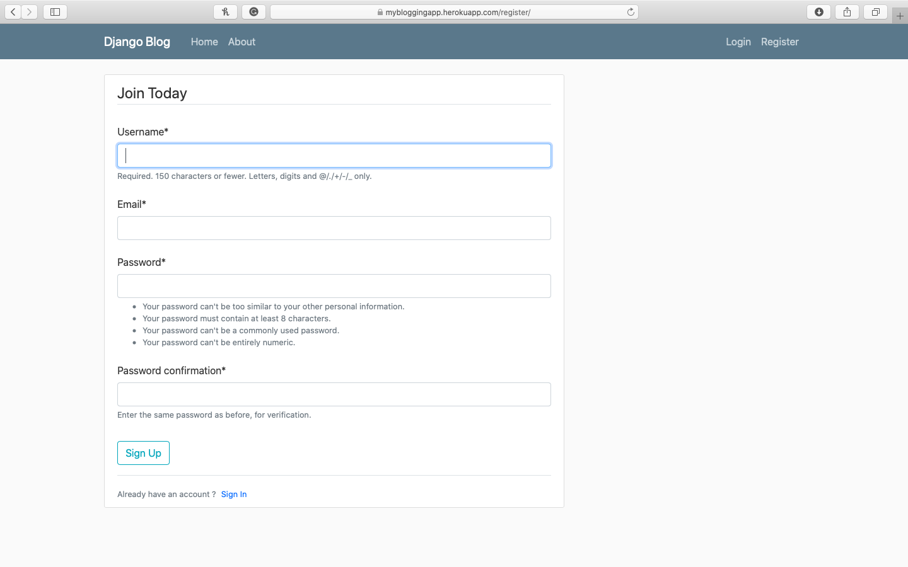
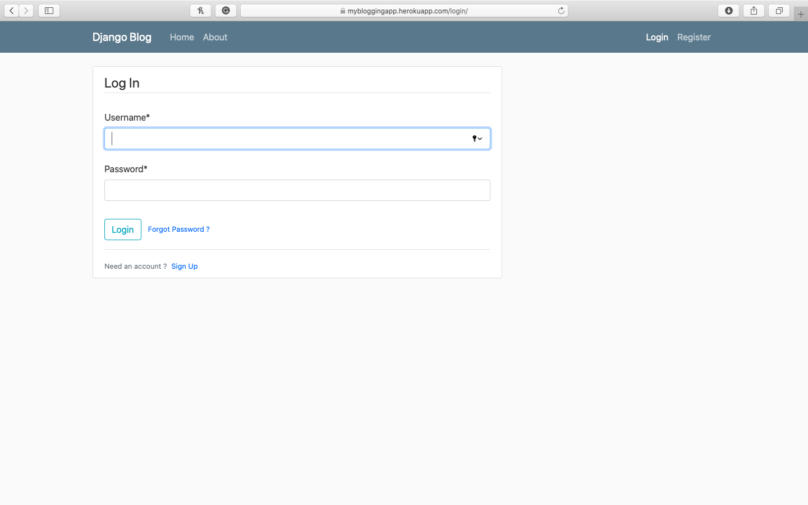
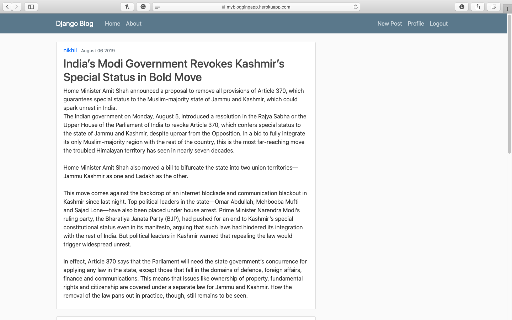
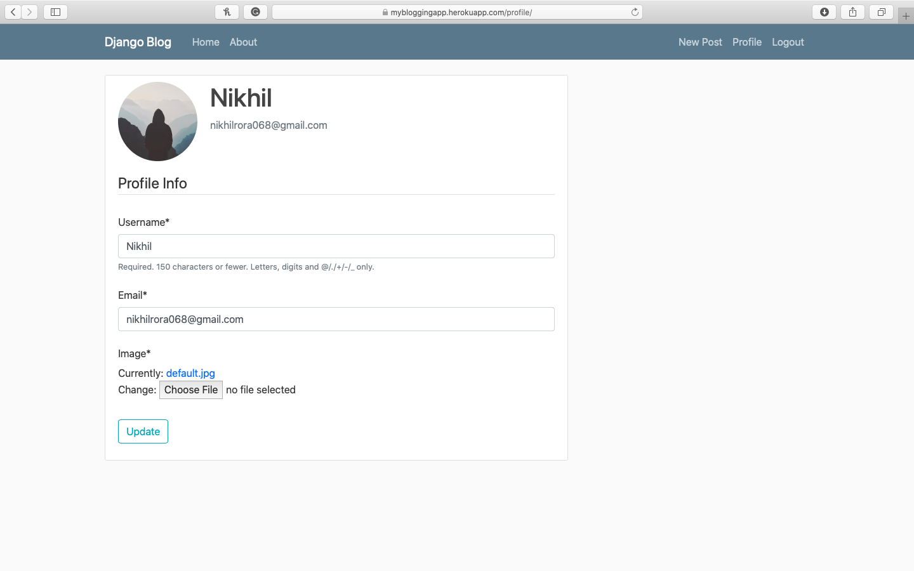
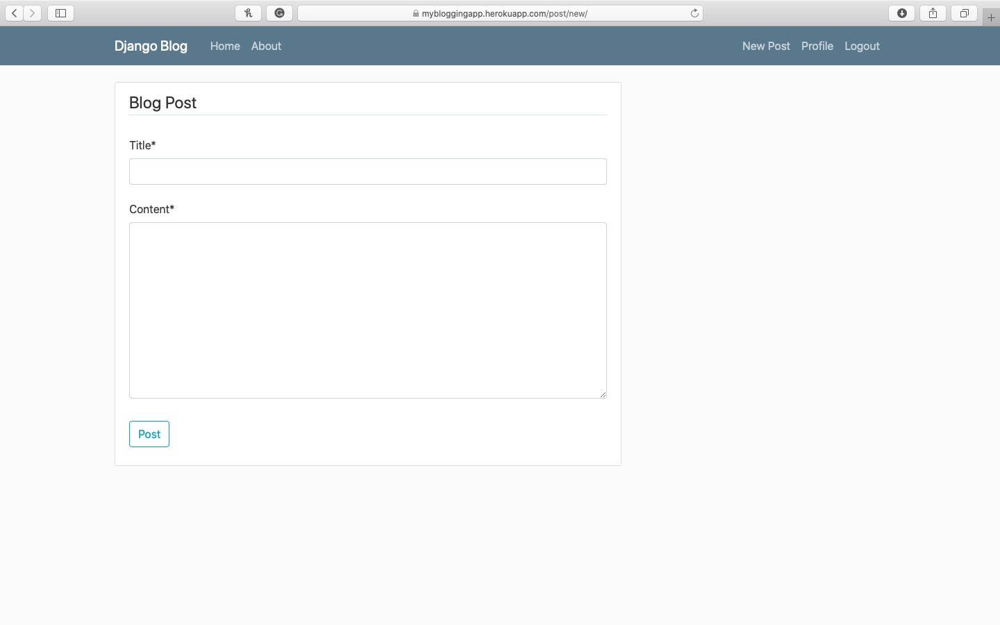

[](https://python.org)
[](https://djangoproject.com)

# Blog-app

## Live Demo - http://mybloggingapp.herokuapp.com

## Running the Project Locally

1. Clone the repository to your local machine:

```bash
git clone https://github.com/nikhilarora068/Blog-app.git
```

2. Install the requirements:

```bash
pip install -r requirements.txt
```

3. Apply migrations:

```bash
python manage.py migrate
```

4. Collect the Static folder files:

```bash
python manage.py collectstatic
```

5. Run the development server:

```bash
python manage.py runserver
```
# Some Snippets of the running project 


## REGISTRATION PAGE



## LOGIN PAGE


## HOME PAGE


## PROFILE PAGE


## NEW POST PAGE

